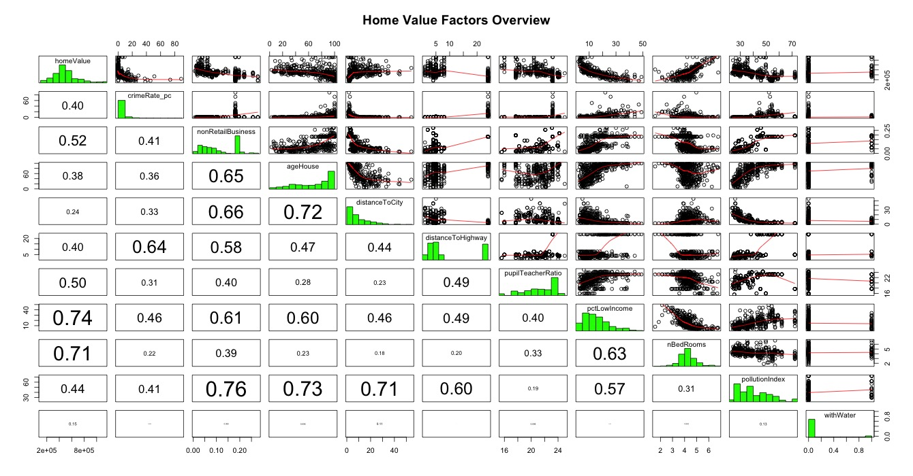
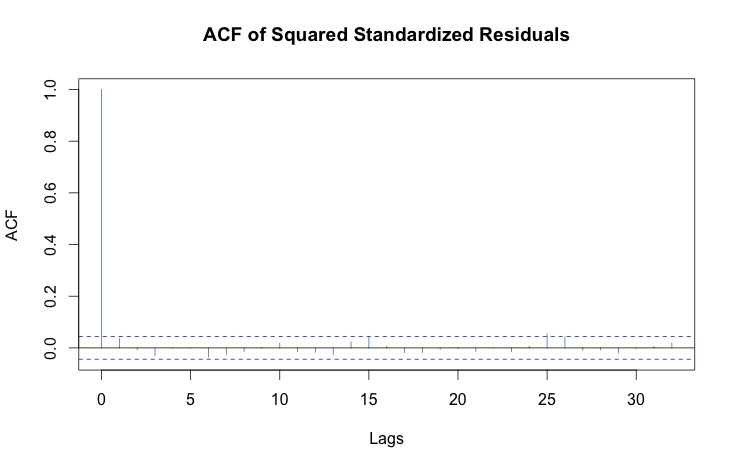

## Part 1

Load data and display some basic statistics:
```{r warning=FALSE, echo=FALSE}
# load packages
library(car)
library(ggplot2)
library(lattice)
library(car)
library(lmtest)
library(sandwich)
library(AER)
library(fGarch)
library(ivpack)
library(stargazer)
require(forecast)
# load data
setwd("~/Google Drive/W271 - Applied Regression & Time Series/Assignment/lab3_forStudents_2/lab3_data")
data<-read.csv('houseValueData.csv', header=T)
str(data)
# show simple univariate stats for each variable
summary(data)

```


We first generate the matrix plot to have an overview of all variables. 



Upon first galance, two things stands out: no highly-correlated pair of variables, thus collinearity won't be a concern of our analysis, in addition, the majority of the distributions are skewed and non-normal. More specifically:

- crime rate, distance to city, low income percentage, and pollution index are negatively skewed.

- age of house, pupil teacher ratio are positively skewed

- non retail business, and distance to highway have bi-modal distribution

- home value, number of bedroom are approximately normal

we then do some transformation on the variables:

- take log of the negatively skewed variables

- convert distance to highway to a binary variable, **farFromHighway**, if it's bigger than 10

- for positive skewness, we "reverse" the variable first then take log, and the interpretation of coefficients in the model need to adjust accordingly. Specifically:

 a. take the reciprocal of pupilTeacherRatio, it becomes teacherPupilRatio

 b. take 100 - ageHouse, it becomes proportion of house built **after** 1950
 
Let's evaluate matrix plot again with the transformed variables:


```{r echo=FALSE}
panel.hist <- function(x, ...)
{
    usr <- par("usr"); on.exit(par(usr))
    par(usr = c(usr[1:2], 0, 1.5) )
    h <- hist(x, plot = FALSE)
    breaks <- h$breaks; nB <- length(breaks)
    y <- h$counts; y <- y/max(y)
    rect(breaks[-nB], 0, breaks[-1], y, col = "green", ...)
}
panel.cor <- function(x, y, digits = 2, prefix = "", cex.cor, ...)
{
    usr <- par("usr"); on.exit(par(usr))
    par(usr = c(0, 1, 0, 1))
    r <- abs(cor(x, y, use='complete.obs'))
    txt <- format(c(r, 0.123456789), digits = digits)[1]
    txt <- paste0(prefix, txt)
    if(missing(cex.cor)) cex.cor <- 0.8/strwidth(txt)
    text(0.5, 0.5, txt, cex = cex.cor * r)
}
# matrix plot
#pairs(homeValue~crimeRate_pc+nonRetailBusiness+ageHouse+distanceToCity+distanceToHighway+pupilTeacherRatio+pctLowIncome+nBedRooms+pollutionIndex+withWater, data=data, upper.panel=panel.smooth, lower.panel=panel.cor, diag.panel=panel.hist, main='Home Value Factors Overview')
```

```{r, echo=FALSE}
# data transform
data$logCrimeRate <- log(data$crimeRate_pc)
data$logDistToCity <- log(data$distanceToCity)
data$logLowIncomePct <- log(data$pctLowIncome)
data$logPollutionIndex <- log(data$pollutionIndex)
data$farFromHighway <- data$distanceToHighway > 10
data$logTeacherPupilRatio <- log(1/data$pupilTeacherRatio)
data$newHouse <- log(101-data$ageHouse)
# matrix plot
#pairs(homeValue~logCrimeRate+nonRetailBusiness+newHouse+logDistToCity+farFromHighway+logTeacherPupilRatio+logLowIncomePct+nBedRooms+logPollutionIndex+withWater, data=data, upper.panel=panel.smooth, lower.panel=panel.cor, diag.panel=panel.hist, main='Home Value Transformed Factors Overview')
```

Based on correlation coefficients, we propose a hypothesis of house value:

**_House value is significantly affected by factors from crime rate, education quality (represented by teacher pupil ratio), low income percentage, bedroom nuber, and pollution index._**

We build a linear model first with those variables:

```{r, echo=FALSE}
# linear model
m0 <- lm(homeValue~logCrimeRate+logTeacherPupilRatio+logLowIncomePct+nBedRooms+logPollutionIndex, data=data)

summary(m0)
```

We can see that education quality, low income percentage, and number of bedrooms have significant impact on house value. On average, one more bedroom will increase the value by $78.6k,  one percent increase in the low income percentage will reduce house value by $173.7k, and one percent increase in teacher pupil ratio will increase house value by $314.9k. Surprisingly here crime rate is not a significant factor.

Next, we do model diagnostics:

```{r, echo=FALSE}
plot(m0)
```

From the chart we can see, the model doesn't violate homoscedasticity assumption, and there is no concern of outliers in the data. However, the normality and zero-conditional mean assumptions are questionable towards the high value house.

We now add the omitted variables to our model and compare the results:

```{r, echo=FALSE}
m1 <- lm(homeValue~logCrimeRate+logTeacherPupilRatio+logLowIncomePct+nBedRooms+logPollutionIndex
         + farFromHighway + withWater, data=data)

m2 <- lm(homeValue~logCrimeRate+logTeacherPupilRatio+logLowIncomePct+nBedRooms+logPollutionIndex
         + farFromHighway + withWater
         + nonRetailBusiness + ageHouse + logDistToCity, data=data)

#stargazer(m0, m1, m2,         
#          dep.var.labels = "House Value",
#          omit = NULL, 
#          out = "p1_table.html", df= F, ci=T,
#          omit.labels = NULL
#          )
```


\begin{table}[!htbp] \centering 
  \caption{House Value Model Summary} 
  \label{} 
\begin{tabular}{@{\extracolsep{5pt}}lccc} 
\\[-1.8ex]\hline 
\hline \\[-1.8ex] 
 & \multicolumn{3}{c}{\textit{Dependent variable:}} \\ 
\cline{2-4} 
\\[-1.8ex] & \multicolumn{3}{c}{House Value} \\ 
\\[-1.8ex] & (1) & (2) & (3)\\ 
\hline \\[-1.8ex] 
 logCrimeRate & 961.901 & 8,156.263 & 1,666.250 \\ 
  & ($-$7,506.387, 9,430.188) & ($-$3,607.645, 19,920.170) & ($-$9,613.651, 12,946.150) \\ 
  & & & \\ 
 logTeacherPupilRatio & 314,867.800$^{***}$ & 276,554.600$^{***}$ & 274,726.300$^{***}$ \\ 
  & (206,435.600, 423,300.000) & (163,014.900, 390,094.300) & (165,000.700, 384,451.900) \\ 
  & & & \\ 
 logLowIncomePct & $-$173,745.000$^{***}$ & $-$172,090.700$^{***}$ & $-$181,403.400$^{***}$ \\ 
  & ($-$200,612.200, $-$146,877.800) & ($-$198,877.200, $-$145,304.200) & ($-$208,434.500, $-$154,372.300) \\ 
  & & & \\ 
 nBedRooms & 78,593.580$^{***}$ & 78,980.880$^{***}$ & 69,215.170$^{***}$ \\ 
  & (59,556.310, 97,630.850) & (60,093.840, 97,867.920) & (50,660.260, 87,770.080) \\ 
  & & & \\ 
 logPollutionIndex & 5,615.722 & $-$14,073.550 & $-$182,025.200$^{***}$ \\ 
  & ($-$58,031.470, 69,262.920) & ($-$78,298.340, 50,151.240) & ($-$264,518.800, $-$99,531.650) \\ 
  & & & \\ 
 farFromHighway &  & $-$37,459.410 & $-$14,017.560 \\ 
  &  & ($-$82,239.580, 7,320.766) & ($-$57,147.040, 29,111.930) \\ 
  & & & \\ 
 withWater &  & 53,643.820$^{***}$ & 54,161.730$^{***}$ \\ 
  &  & (13,550.510, 93,737.120) & (16,438.880, 91,884.590) \\ 
  & & & \\ 
 nonRetailBusiness &  &  & $-$297,234.800$^{**}$ \\ 
  &  &  & ($-$540,375.300, $-$54,094.240) \\ 
  & & & \\ 
 ageHouse &  &  & 393.526 \\ 
  &  &  & ($-$237.781, 1,024.833) \\ 
  & & & \\ 
 logDistToCity &  &  & $-$81,172.700$^{***}$ \\ 
  &  &  & ($-$105,548.500, $-$56,796.860) \\ 
  & & & \\ 
 Constant & 1,554,893.000$^{***}$ & 1,515,577.000$^{***}$ & 2,339,513.000$^{***}$ \\ 
  & (1,096,258.000, 2,013,528.000) & (1,056,843.000, 1,974,311.000) & (1,827,152.000, 2,851,874.000) \\ 
  & & & \\ 
\hline \\[-1.8ex] 
Observations & 400 & 400 & 400 \\ 
R$^{2}$ & 0.737 & 0.744 & 0.777 \\ 
Adjusted R$^{2}$ & 0.734 & 0.739 & 0.771 \\ 
Residual Std. Error & 101,125.200 & 100,125.200 & 93,770.050 \\ 
F Statistic & 221.330$^{***}$ & 162.682$^{***}$ & 135.630$^{***}$ \\ 
\hline 
\hline \\[-1.8ex] 
\textit{Note:}  & \multicolumn{3}{r}{$^{*}$p$<$0.1; $^{**}$p$<$0.05; $^{***}$p$<$0.01} \\ 
\end{tabular} 
\end{table} 

We can see that in model 3 pollution index becomes significant. In addition, distance to city and water proximity are also significantly affecting house value. Finally, we build the linear model with the significant predictors identified above:

```{r, echo=FALSE}
m3 <- lm(homeValue~logTeacherPupilRatio+logLowIncomePct+nBedRooms+logPollutionIndex
         + withWater + logDistToCity, data=data)

summary(m3)
```

we see that being further away from city will reduce house value, while having a body of water closeby will increase the value. Finally we diagnose this model

```{r, echo=FALSE}
plot(m3)
```

Similarly, the normality and zero-conditional mean assumption are questionable as price increases. Therefore we will use robust error to compensate:

```{r, echo=FALSE}
summary(m3)
robust.se(m3)[,2]
```

## Part 2

Load data, package, and show descriptive statistics: 

```{r, echo=FALSE}
setwd("~/Google Drive/W271 - Applied Regression & Time Series/Assignment/lab3_forStudents_2/lab3_data")
data <- read.csv('lab3_series02.csv', header = T)
str(data)
x <- ts(data$DXCM.Close)
summary(x)
```

Let's evaluate the time series plot, histogram, ACF and PACF of the data:

```{r,echo=FALSE}
par(mfrow=c(2,2))
hist(x, breaks="FD", col="blue",main="Histogram DXCM Closing Price")
ts.plot(x, main="DXCM Closing Price Series")
acf(x, 30, main="ACF : DXCM Closing Price")
pacf(x,30, main="PACF: DXCM Closing Price")

# Box test
Box.test(x, type="Ljung-Box")
```

The Box test indicates that our original series $x$ is **not** a stationary series, and we can observe a upward trend, thus simple ARMA model won't be adequate and we further evaluate the difference of the $x$, $x_d$:

```{r,echo=FALSE}
xd <- diff(x)
par(mfrow=c(2,2))
hist(xd, breaks="FD", col="blue",main="Histogram DXCM Closing Diff")
ts.plot(xd, main="DXCM Closing Difference")
acf(xd, 30, main="ACF : DXCM Closing Difference")
pacf(xd,30, main="PACF: DXCM Closing Difference")
# box test
Box.test(xd, type="Ljung-Box")
```

Box test now indicates $x_d$ is stationary, however we can see that the variance of $x_d$ is time-varying, as such, we **cannot** apply ARIMA alone. To address that, we use ARIMA to fit the original series $x$, then apply GARCH model on the ARIMA residue to estimate conditional variance and obtain the final prediction by integrating GARCH results into the ARIMA prediction. To obtain the best ARIMA model, we run the following procedure to identify the optimal order $(p,d,q)$:


```{r}
# procedure to get best ARIMA order
get.best.arima <- function(x.ts, maxord = c(1,1,1))  # don't change any of this code
{
  best.aic <- 1e8
  n <- length(x.ts)
  for (p in 0:maxord[1]) for(d in 0:maxord[2]) for(q in 0:maxord[3]) 
  {
    fit <- arima(x.ts, order = c(p,d,q))
    fit.aic <- -2 * fit$loglik + (log(n) + 1) * length(fit$coef)
    if (fit.aic < best.aic) 
    {
      best.aic <- fit.aic
      best.fit <- fit
      best.model <- c(p,d,q) 
    }
  }
  list(best.aic, best.fit, best.model)
}
# model selection
#x.best = get.best.arima(x, maxord = c(2,2,2))[[3]]
```

the best order of ARIMA is $(0,1,0)$:

```{r, echo=F}
# fit ARIMA(0,1,0)
x.arima <- arima(x, order=c(2,1,2))
# Model Diagnostics: Residuals
summary(x.arima$resid)
Box.test(x.arima$resid, type="Ljung-Box")

par(mfrow=c(2,2))
  plot(x.arima$resid, col="blue", main="Residual Series")
  hist(x.arima$resid, col="gray", main="Residuals")
  acf(x.arima$resid , ylim=c(0,0.2), main="ACF: Residual Series")  
  acf(x.arima$resid^2 , ylim=c(0,0.2), main="ACF: Squared Residual Series")

```

we can see although the ACF of residual indicates insignificant autocorrelation, ACF of squared residual showed otherwise. Let further check the in-sample fit of the model:


```{r, echo=FALSE}
# Model Performance Evaluation: In-Sample Fit
  par(mfrow=c(1,1))
  plot.ts(x, col="red", 
        main="Original vs ARIMA(0,1,0) Estimated Series with Resdiauls",
        ylab="Original and Estimated Values", pch=1, lty=2)
  par(new=T)
  plot.ts(fitted(x.arima),col="blue",axes=T,xlab="",ylab="", lty=1) 
  leg.txt <- c("Original Series", "Estimated Series", "Residuals")
  legend("topleft", legend=leg.txt, lty=c(1,1,2), 
         col=c("red","blue","green"), bty='n', cex=1)
  par(new=T)
  plot.ts(x.arima$resid,axes=F,xlab="",ylab="",col="green",
           lty=2, pch=1, col.axis="green")
  axis(side=4, col="green")
  mtext("Residuals", side=4, line=2,col="green")
```

the in-sample fit closely follow the original series. However the residuals demonstrate varying variance, we apply GARCH model on the residuals to correct the prediction uncertainty:


```{r, echo=FALSE}
steps <- 36
# standard error of the residuals from the ARIMA model
se.resid <- sqrt(x.arima$sigma2) # or stdev(x.arima.residuals)
# fit garch for the residual
x.res.garch <- garchFit(x.arima$residuals~garch(1,1), trace=F)
# forecast with GARCH model
x.res.garch.fcast <- predict(x.res.garch, n.ahead = steps)
# forecast with ARIMA model
forecast <- forecast.Arima(x.arima, h=steps)
# standard errors from the ARIMA model (for prediction)
se.arima <- (forecast$upper[,2]-forecast$mean)/1.96
# forecasting conditional standard errors from GARCH
cse.garch <- x.res.garch.fcast$standardDeviation
# put the conditional SE back to ARIMA SE
se.combine <- se.arima / se.resid * cse.garch
forecast$mean <- forecast$mean + x.res.garch.fcast$meanForecast 
forecast$lower[,2] <- forecast$mean - 1.96 * se.combine
forecast$lower[,1] <- forecast$mean - 1.645 * se.combine
forecast$upper[,2] <- forecast$mean + 1.96 * se.combine
forecast$upper[,1] <- forecast$mean + 1.645 * se.combine

# chart overlay
plot(forecast,
     main="36-Step Ahead Forecast and Original & Estimated Series",
     xlab="Time Period", 
     ylab="Original, Estimated, and Forecasted Values",
     xlim=c(2100,2368),ylim=c(50,100),lty=2,lwd=1.5)
par(new=T)
plot.ts(fitted(x.arima),col="blue", 
        lty=2, lwd=2, xlab="",ylab="",xlim=c(2100,2368),ylim=c(50,100))
leg.txt <- c("Original Series", "Estimated Series", "Forecast")
legend("topright", legend=leg.txt, lty=c(2,2,1), lwd=c(1,2,2),
       col=c("black","blue","blue"), bty='n', cex=1)
```

The prediction of $ARIMA(0,1,0)$ gives a flat prediction, due to the fact that the model doesn't have AR and MA coefficient. Thus the prediction is equivalent to a random walk without noise, which has become a constant of the last observation. However, after correct the prediction variance, we find the confidence interval is reduced compared with that given by ARIMA model. Finally, the ACF of squared residuals of GARCH model shows the variance of residual is no long varying by time.




## Part 3

Load data and show descriptive statistics:

```{r, echo=FALSE}
rm(list=ls())
setwd("~/Google Drive/W271 - Applied Regression & Time Series/Assignment/lab3_forStudents_2/lab3_data")
data <- read.csv('globalWarming.csv', header = T)
str(data)
x <- ts(data$data.science, start=c(2004,1,4), frequency = 52)
summary(x)
ts.plot(x, main="Web Search Rate of Global Warming")
```

upon close look, it appears the majority of the dynamics of the series appears after 2011, which prior to that it's mostly flat without too much changes. Let's then cut the series into two: before and after 2011


```{r}
cutoff = 365
x1 <- ts(data$data.science[1:cutoff], start=c(2004,1,4), frequency = 52)
x2 <- ts(data$data.science[(cutoff+1):630], start=c(2011,1,2), frequency = 52)
```

we then evaluate ACF of both series, and conduct Box test:

```{r, echo=F}
par(mfrow=c(2,2))
acf(x1, ylim=c(0,0.5))
acf(x1^2, ylim=c(0,0.5))
acf(x2)
acf(x2^2)

Box.test(x1, type="Ljung-Box")
Box.test(x2, type="Ljung-Box")
```

For series $x_1$, ACF of both original and squared value don't show significant autocorrelation, while $x_2$ shows strong autocorrelation for both. In addition, the Box test indicates that we can't reject the null hypothesis that $x_1$ is white-noise, white $x_2$ is significantly autocorrelated.

Thus we will focus on modeling $x_2$ to predict the search rate of Gobal Warming.

```{r,echo=F}
par(mfrow=c(2,2))
  plot(x2, col="blue", main="X2 Series")
  hist(x2, col="gray", main="Search Rate")
  acf(x2, main="ACF: X2 Series")
  pacf(x2, main="PACF: X2 Series")  
```

From ACF we see that it's a non-staionary series, which show strong persistent upward trend. We then use ARIMA model to fit it.

```{r,echo=F}
x2.arima <- auto.arima(x2)
x2.arima
# Model Diagnostics: Residuals
#summary(x2.arima$resid)
Box.test(x2.arima$resid, type="Ljung-Box")

par(mfrow=c(2,2))
  plot(x2.arima$resid, col="blue", main="Residual Series")
  hist(x2.arima$resid, col="gray", main="Residuals")
  acf(x2.arima$resid , ylim=c(0,0.4), main="ACF: Residual Series")  
  acf(x2.arima$resid^2 , ylim=c(0,0.4), main="ACF: Squared Residual Series")
```

The best model is ARIMA(1,1,1)(0,1,1)[52], and the ACF of squared residual also indicate its variation is time-varying.

```{r, echo=FALSE}
# Model Performance Evaluation: In-Sample Fit
  par(mfrow=c(1,1))
  plot.ts(x2, col="red", 
        main="Original vs ARIMA(1,1,1)(0,1,1)[52] Estimated Series with Resdiauls",
        ylab="Original and Estimated Values", pch=1, lty=2)
  par(new=T)
  plot.ts(fitted(x2.arima),col="blue",axes=F,xlab="",ylab="", lty=1) 
  leg.txt <- c("Original Series", "Estimated Series", "Residuals")
  legend("topleft", legend=leg.txt, lty=c(1,1,2), 
         col=c("red","blue","green"), bty='n', cex=1)
  par(new=T)
  plot.ts(x2.arima$resid,axes=F,xlab="",ylab="",col="green",
           lty=2, pch=1, col.axis="green")
  axis(side=4, col="green")
  mtext("Residuals", side=4, line=2,col="green")
```

Similar with part 2, we fit a GARCH model on the residuals, and integrate the conditional variance from GARCH into the prediction of ARIMA model:

```{r, echo=FALSE}
steps <- 12
# standard error of the residuals from the ARIMA model
se.resid <- sqrt(x2.arima$sigma2) # or stdev(x.arima.residuals)
# fit garch for the residual
x.res.garch <- garchFit(x2.arima$residuals~garch(1,1), trace=F)
# forecast with GARCH model
x.res.garch.fcast <- predict(x.res.garch, n.ahead = steps)
# forecast with ARIMA model
forecast <- forecast.Arima(x2.arima, h=steps)
# standard errors from the ARIMA model (for prediction)
se.arima <- (forecast$upper[,2]-forecast$mean)/1.96
# forecasting conditional standard errors from GARCH
cse.garch <- x.res.garch.fcast$standardDeviation
# put the conditional SE back to ARIMA SE
se.combine <- se.arima / se.resid * cse.garch
forecast$mean <- forecast$mean + x.res.garch.fcast$meanForecast 
forecast$lower[,2] <- forecast$mean - 1.96 * se.combine
forecast$lower[,1] <- forecast$mean - 1.645 * se.combine
forecast$upper[,2] <- forecast$mean + 1.96 * se.combine
forecast$upper[,1] <- forecast$mean + 1.645 * se.combine

# chart overlay
plot(forecast,
     main="12-Step Ahead Forecast and Original & Estimated Series",
     xlab="Time Period", 
     ylab="Original and Forecasted Values",
     lty=2,lwd=1.5)
par(new=T)
#plot.ts(fitted(x2.arima),axes=F, col="blue", 
#        lty=2, lwd=2, xlab="",ylab="")
leg.txt <- c("Original Series", "Forecast")
legend("topleft", legend=leg.txt, lty=c(2,2,1), lwd=c(1,2,2),
       col=c("black","blue"), bty='n', cex=1)
```

Finally, the ACF of squared residuals of GARCH model shows the variance of residual is no long varying by time.


## Part 4

Load data and show descriptive statistics:

```{r, echo=FALSE}
rm(list=ls())
setwd("~/Google Drive/W271 - Applied Regression & Time Series/Assignment/lab3_forStudents_2/lab3_data")
load('gasOil.Rdata')
str(gasOil)
prod <- ts(gasOil$Production, start=c(1978,1,1), frequency = 12)
price <- ts(gasOil$Price, start=c(1978,1,1), frequency = 12)
summary(gasOil)

par(mfrow=c(1,1))
  plot.ts(price, col="red", 
        main="U.S. Oil Production & Price",
        ylab="Oil Price", pch=1)
  par(new=T)  
  leg.txt <- c("Oil Price", "Oil Production")
  legend("bottomleft", legend=leg.txt, lty=c(1,1,2), 
         col=c("red","green"), bty='n', cex=1)
  par(new=T)
  plot.ts(prod,axes=F,xlab="",ylab="",col="green",
           pch=1, col.axis="green")
  axis(side=4, col="green")
  mtext("Production", side=4, line=2,col="green")
```


### Task 2 - Forecast the inflation-adjusted gas prices from 2012 to 2016


```{r,echo=F}
par(mfrow=c(2,2))
  plot(price, col="blue", main="U.S. Oil Price Series")
  hist(price, col="gray", main="U.S. Oil Price")
  acf(price, main="ACF: U.S. Oil Price Series")
  pacf(price, main="PACF: U.S. Oil Price Series")  
```

From ACF we see that it's a non-staionary series, which show strong persistent upward trend. We then use ARIMA model to fit it.

```{r,echo=F}
price.arima <- auto.arima(price)
#price.arima <- arima(price, order=c(1,1,3), seasonal=list(order=c(0,0,0), 12))
# Model Diagnostics: Residuals
Box.test(price.arima$resid, type="Ljung-Box")

par(mfrow=c(2,2))
  plot(price.arima$resid, col="blue", main="Residual Series")
  hist(price.arima$resid, col="gray", main="Residuals")
  acf(price.arima$resid , ylim=c(0,0.4), main="ACF: Residual Series")  
  acf(price.arima$resid^2 , ylim=c(0,0.6), main="ACF: Squared Residual Series")
```

The best model is ARIMA(1,1,3), and the ACF of squared residual also indicate its variation is time-varying.

```{r, echo=FALSE}
# Model Performance Evaluation: In-Sample Fit
  par(mfrow=c(1,1))
  plot.ts(price, col="red", 
        main="Original vs ARIMA(1,1,3) Estimated Series with Resdiauls",
        ylab="Original and Estimated Values", pch=1, lty=2)
  par(new=T)
  plot.ts(fitted(price.arima),col="blue",axes=F,xlab="",ylab="", lty=1) 
  leg.txt <- c("Original Series", "Estimated Series", "Residuals")
  legend("topleft", legend=leg.txt, lty=c(1,1,2), 
         col=c("red","blue","green"), bty='n', cex=1)
  par(new=T)
  plot.ts(price.arima$resid,axes=F,xlab="",ylab="",col="green",
           lty=2, pch=1, col.axis="green")
  axis(side=4, col="green")
  mtext("Residuals", side=4, line=2,col="green")
```

Similar with part 2, we fit a GARCH model on the residuals, and integrate the conditional variance from GARCH into the prediction of ARIMA model:

```{r, echo=FALSE}
steps <- 48
# standard error of the residuals from the ARIMA model
se.resid <- sqrt(price.arima$sigma2) # or stdev(x.arima.residuals)
# fit garch for the residual
x.res.garch <- garchFit(price.arima$residuals~garch(1,1), trace=F)
# forecast with GARCH model
x.res.garch.fcast <- predict(x.res.garch, n.ahead = steps)
# forecast with ARIMA model
forecast <- forecast.Arima(price.arima, h=steps)
# standard errors from the ARIMA model (for prediction)
se.arima <- (forecast$upper[,2]-forecast$mean)/1.96
# forecasting conditional standard errors from GARCH
cse.garch <- x.res.garch.fcast$standardDeviation
# put the conditional SE back to ARIMA SE
se.combine <- se.arima / se.resid * cse.garch
forecast$mean <- forecast$mean + x.res.garch.fcast$meanForecast 
forecast$lower[,2] <- forecast$mean - 1.96 * se.combine
forecast$lower[,1] <- forecast$mean - 1.645 * se.combine
forecast$upper[,2] <- forecast$mean + 1.96 * se.combine
forecast$upper[,1] <- forecast$mean + 1.645 * se.combine

# chart overlay
plot(forecast,
     main="4-year Ahead Forecast and Original & Estimated Series",
     xlab="Time Period", 
     ylab="Original and Forecasted Values",
     lty=2,lwd=1.5,ylim=c(0,10))
par(new=T)
#plot.ts(fitted(x2.arima),axes=F, col="blue", 
#        lty=2, lwd=2, xlab="",ylab="")
leg.txt <- c("Original Series", "Forecast")
legend("topleft", legend=leg.txt, lty=c(2,2,1), lwd=c(1,2,2),
       col=c("black","blue"), bty='n', cex=1)
```

Finally, the ACF of squared residuals of GARCH model shows the variance of residual is no long varying by time.

