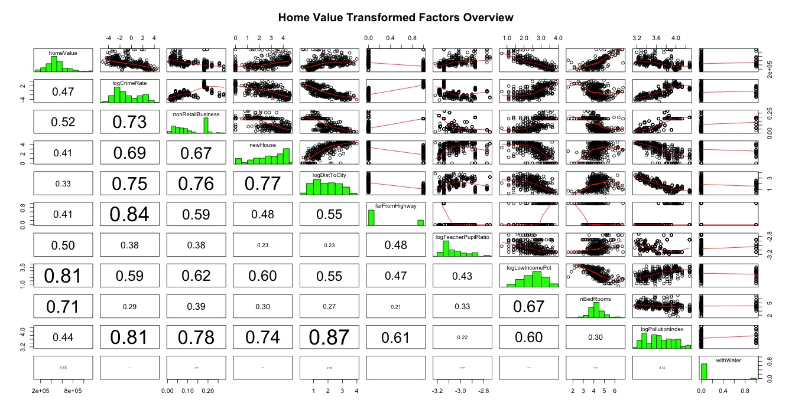

## Part 1

Load data and display some basic statistics:
```{r warning=FALSE, echo=FALSE}
# load packages
library(car)
library(ggplot2)
library(lattice)
library(car)
library(lmtest)
library(sandwich)
library(AER)
library(fGarch)
library(ivpack)
library(stargazer)
# load data
setwd("~/Google Drive/W271 - Applied Regression & Time Series/Assignment/lab3_forStudents_2/lab3_data")
data<-read.csv('houseValueData.csv', header=T)
str(data)
# show simple univariate stats for each variable
summary(data)

```


We first generate the matrix plot to have an overview of all variables. 


Upon first galance, two things stands out: no highly-correlated pair of variables, thus collinearity won't be a concern of our analysis, in addition, the majority of the distributions are skewed and non-normal. More specifically:

- crime rate, distance to city, low income percentage, and pollution index are negatively skewed.

- age of house, pupil teacher ratio are positively skewed

- non retail business, and distance to highway have bi-modal distribution

- home value, number of bedroom are approximately normal

we then do some transformation on the variables:

- take log of the negatively skewed variables

- convert distance to highway to a binary variable, **farFromHighway**, if it's bigger than 10

- for positive skewness, we "reverse" the variable first then take log, and the interpretation of coefficients in the model need to adjust accordingly. Specifically:

 a. take the reciprocal of pupilTeacherRatio, it becomes teacherPupilRatio

 b. take 100 - ageHouse, it becomes proportion of house built **after** 1950
 
Let's evaluate matrix plot again with the transformed variables:



```{r echo=FALSE}
panel.hist <- function(x, ...)
{
    usr <- par("usr"); on.exit(par(usr))
    par(usr = c(usr[1:2], 0, 1.5) )
    h <- hist(x, plot = FALSE)
    breaks <- h$breaks; nB <- length(breaks)
    y <- h$counts; y <- y/max(y)
    rect(breaks[-nB], 0, breaks[-1], y, col = "green", ...)
}
panel.cor <- function(x, y, digits = 2, prefix = "", cex.cor, ...)
{
    usr <- par("usr"); on.exit(par(usr))
    par(usr = c(0, 1, 0, 1))
    r <- abs(cor(x, y, use='complete.obs'))
    txt <- format(c(r, 0.123456789), digits = digits)[1]
    txt <- paste0(prefix, txt)
    if(missing(cex.cor)) cex.cor <- 0.8/strwidth(txt)
    text(0.5, 0.5, txt, cex = cex.cor * r)
}
# matrix plot
#pairs(homeValue~crimeRate_pc+nonRetailBusiness+ageHouse+distanceToCity+distanceToHighway+pupilTeacherRatio+pctLowIncome+nBedRooms+pollutionIndex+withWater, data=data, upper.panel=panel.smooth, lower.panel=panel.cor, diag.panel=panel.hist, main='Home Value Factors Overview')
```

```{r, echo=FALSE}
# data transform
data$logCrimeRate <- log(data$crimeRate_pc)
data$logDistToCity <- log(data$distanceToCity)
data$logLowIncomePct <- log(data$pctLowIncome)
data$logPollutionIndex <- log(data$pollutionIndex)
data$farFromHighway <- data$distanceToHighway > 10
data$logTeacherPupilRatio <- log(1/data$pupilTeacherRatio)
data$newHouse <- log(101-data$ageHouse)
# matrix plot
#pairs(homeValue~logCrimeRate+nonRetailBusiness+newHouse+logDistToCity+farFromHighway+logTeacherPupilRatio+logLowIncomePct+nBedRooms+logPollutionIndex+withWater, data=data, upper.panel=panel.smooth, lower.panel=panel.cor, diag.panel=panel.hist, main='Home Value Transformed Factors Overview')
```

Based on correlation coefficients, we propose a hypothesis of house value:

**_House value is significantly affected by factors from crime rate, education quality (represented by teacher pupil ratio), low income percentage, bedroom nuber, and pollution index._**

We build a linear model first with those variables:

```{r, echo=FALSE}
# linear model
m0 <- lm(homeValue~logCrimeRate+logTeacherPupilRatio+logLowIncomePct+nBedRooms+logPollutionIndex, data=data)

summary(m0)
```

We can see that education quality, low income percentage, and number of bedrooms have significant impact on house value. On average, one more bedroom will increase the value by $78.6k,  one percent increase in the low income percentage will reduce house value by $173.7k, and one percent increase in teacher pupil ratio will increase house value by $314.9k. Surprisingly here crime rate is not a significant factor.

Next, we do model diagnostics:

```{r, echo=FALSE}
plot(m0)
```

From the chart we can see, the model doesn't violate homoscedasticity assumption, and there is no concern of outliers in the data. However, the normality and zero-conditional mean assumptions are questionable towards the high value house.

We now add the omitted variables to our model and compare the results:

```{r, echo=FALSE}
m1 <- lm(homeValue~logCrimeRate+logTeacherPupilRatio+logLowIncomePct+nBedRooms+logPollutionIndex
         + farFromHighway + withWater, data=data)

m2 <- lm(homeValue~logCrimeRate+logTeacherPupilRatio+logLowIncomePct+nBedRooms+logPollutionIndex
         + farFromHighway + withWater
         + nonRetailBusiness + ageHouse + logDistToCity, data=data)

#stargazer(m0, m1, m2,         
#          dep.var.labels = "House Value",
#          omit = NULL, 
#          out = "p1_table.html", df= F, ci=T,
#          omit.labels = NULL
#          )
```


\begin{table}[!htbp] \centering 
  \caption{House Value Model Summary} 
  \label{} 
\begin{tabular}{@{\extracolsep{5pt}}lccc} 
\\[-1.8ex]\hline 
\hline \\[-1.8ex] 
 & \multicolumn{3}{c}{\textit{Dependent variable:}} \\ 
\cline{2-4} 
\\[-1.8ex] & \multicolumn{3}{c}{House Value} \\ 
\\[-1.8ex] & (1) & (2) & (3)\\ 
\hline \\[-1.8ex] 
 logCrimeRate & 961.901 & 8,156.263 & 1,666.250 \\ 
  & ($-$7,506.387, 9,430.188) & ($-$3,607.645, 19,920.170) & ($-$9,613.651, 12,946.150) \\ 
  & & & \\ 
 logTeacherPupilRatio & 314,867.800$^{***}$ & 276,554.600$^{***}$ & 274,726.300$^{***}$ \\ 
  & (206,435.600, 423,300.000) & (163,014.900, 390,094.300) & (165,000.700, 384,451.900) \\ 
  & & & \\ 
 logLowIncomePct & $-$173,745.000$^{***}$ & $-$172,090.700$^{***}$ & $-$181,403.400$^{***}$ \\ 
  & ($-$200,612.200, $-$146,877.800) & ($-$198,877.200, $-$145,304.200) & ($-$208,434.500, $-$154,372.300) \\ 
  & & & \\ 
 nBedRooms & 78,593.580$^{***}$ & 78,980.880$^{***}$ & 69,215.170$^{***}$ \\ 
  & (59,556.310, 97,630.850) & (60,093.840, 97,867.920) & (50,660.260, 87,770.080) \\ 
  & & & \\ 
 logPollutionIndex & 5,615.722 & $-$14,073.550 & $-$182,025.200$^{***}$ \\ 
  & ($-$58,031.470, 69,262.920) & ($-$78,298.340, 50,151.240) & ($-$264,518.800, $-$99,531.650) \\ 
  & & & \\ 
 farFromHighway &  & $-$37,459.410 & $-$14,017.560 \\ 
  &  & ($-$82,239.580, 7,320.766) & ($-$57,147.040, 29,111.930) \\ 
  & & & \\ 
 withWater &  & 53,643.820$^{***}$ & 54,161.730$^{***}$ \\ 
  &  & (13,550.510, 93,737.120) & (16,438.880, 91,884.590) \\ 
  & & & \\ 
 nonRetailBusiness &  &  & $-$297,234.800$^{**}$ \\ 
  &  &  & ($-$540,375.300, $-$54,094.240) \\ 
  & & & \\ 
 ageHouse &  &  & 393.526 \\ 
  &  &  & ($-$237.781, 1,024.833) \\ 
  & & & \\ 
 logDistToCity &  &  & $-$81,172.700$^{***}$ \\ 
  &  &  & ($-$105,548.500, $-$56,796.860) \\ 
  & & & \\ 
 Constant & 1,554,893.000$^{***}$ & 1,515,577.000$^{***}$ & 2,339,513.000$^{***}$ \\ 
  & (1,096,258.000, 2,013,528.000) & (1,056,843.000, 1,974,311.000) & (1,827,152.000, 2,851,874.000) \\ 
  & & & \\ 
\hline \\[-1.8ex] 
Observations & 400 & 400 & 400 \\ 
R$^{2}$ & 0.737 & 0.744 & 0.777 \\ 
Adjusted R$^{2}$ & 0.734 & 0.739 & 0.771 \\ 
Residual Std. Error & 101,125.200 & 100,125.200 & 93,770.050 \\ 
F Statistic & 221.330$^{***}$ & 162.682$^{***}$ & 135.630$^{***}$ \\ 
\hline 
\hline \\[-1.8ex] 
\textit{Note:}  & \multicolumn{3}{r}{$^{*}$p$<$0.1; $^{**}$p$<$0.05; $^{***}$p$<$0.01} \\ 
\end{tabular} 
\end{table} 

We can see that in model 3 pollution index becomes significant. In addition, distance to city and water proximity are also significantly affecting house value. Finally, we build the linear model with the significant predictors identified above:

```{r, echo=FALSE}
m3 <- lm(homeValue~logTeacherPupilRatio+logLowIncomePct+nBedRooms+logPollutionIndex
         + withWater + logDistToCity, data=data)

summary(m3)
```

we see that being further away from city will reduce house value, while having a body of water closeby will increase the value. Finally we diagnose this model

```{r, echo=FALSE}
plot(m3)
```

Similarly, the normality and zero-conditional mean assumption are questionable as price increases. Therefore we will use robust error to compensate:

```{r, echo=FALSE}
summary(m3)
robust.se(m3)[,2]
```

## Part 2

Load data, package, and show descriptive statistics: 

```{r, echo=FALSE}
setwd("~/Google Drive/W271 - Applied Regression & Time Series/Assignment/lab3_forStudents_2/lab3_data")
data <- read.csv('lab3_series02.csv', header = T)
str(data)
x <- ts(data$DXCM.Close)
summary(x)
```

Let's evaluate the time series plot, histogram, ACF and PACF of the data:

```{r,echo=FALSE}
par(mfrow=c(2,2))
hist(x, breaks="FD", col="blue",main="Histogram DXCM Closing Price")
ts.plot(x, main="DXCM Closing Price Series")
acf(x, 30, main="ACF : DXCM Closing Price")
pacf(x,30, main="PACF: DXCM Closing Price")

# Box test
Box.test(x, type="Ljung-Box")
```

The Box test indicates that our original series $x$ is **not** a stationary series, and we can observe a upward trend, thus simple ARMA model won't be adequate and we further evaluate the difference of the $x$, $x_d$:

```{r,echo=FALSE}
xd <- diff(x)
par(mfrow=c(2,2))
hist(xd, breaks="FD", col="blue",main="Histogram DXCM Closing Diff")
ts.plot(xd, main="DXCM Closing Difference")
acf(xd, 30, main="ACF : DXCM Closing Difference")
pacf(xd,30, main="PACF: DXCM Closing Difference")
# box test
Box.test(xd, type="Ljung-Box")
```

Box test now indicates $x_d$ is stationary, however we can see that the variance of $x_d$ is time-varying, as such, we **cannot** apply ARIMA alone. To address that, let's obtain the return series of our original series $y_t=\frac{x_t-x_{t-1}}{x_{t-1}}$, and apply GARCH model on the return series:

```{r, echo=FALSE}
y <- xd/x[2:length(x)]
par(mfrow=c(2,2))
hist(y, breaks="FD", col="blue",main="Histogram DXCM Return")
ts.plot(y, main="DXCM Return")
acf(y, 30, main="ACF : DXCM Return")
pacf(y,30, main="PACF: DXCM Return")
# box test
Box.test(y, type="Ljung-Box")
y.garch <- garchFit(y~garch(1,1), trace=F)
#plot(y.garch)
```


## Part 3

```{r, echo=FALSE}
setwd("~/Google Drive/W271 - Applied Regression & Time Series/Assignment/lab3_forStudents_2/lab3_data")
data <- read.csv('globalWarming.csv', header = T)
str(data)
x <- ts(data$data.science) #start=c(2004,1,4), end=c(2016,1,24), frequency = 1
summary(x)
ts.plot(x)
```